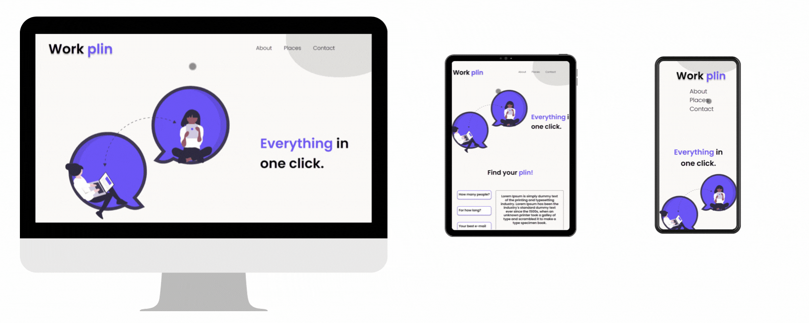

# PAGE FOR A COWORKING SPACE

Challenge is to build a landing page for a coworking space

This challenge was available at https://www.devchallenge.com.br/challenges/5fb5baad237c230021976396/details

⚒️ Technologies used:

- HTML
- CSS
- Figma: https://www.figma.com/file/m95CWMbgT372P5ytrlSluF/Work-Plin?node-id=0%3A1

🤓 Learning:

- Use of HTML tags
- Use of classes
- CSS Flexbox
- Use of external sources
- Improving the knowledge of responsiveness with @media

📄 Requirements:

- Any operating system
- VS Code
- Chrome

📝 License:

-Free for use and change

💻 Result:

